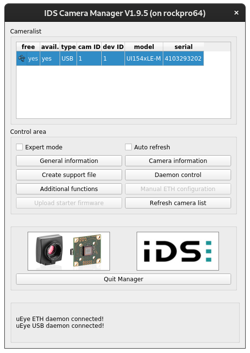

# csDAQ
*NC State Cold-Stage Data Acquisition System*

The repository contains platform independent software to operate the cold stage data acquisition system. 

## RockPro64 Install (From Source)
This section details how create the Armbian OS image and install drivers and dependencies to run the instrument from a [RockPro64](https://www.pine64.org/rockpro64/) single board computer. We recommend to boot and run the device with the 64 GB [EMMC memory module](https://pine64.com/product/64gb-emmc-module/?v=0446c16e2e66) to improve speed. 

1. Download [Armbian Mainline Server Image](https://www.armbian.com/rockpro64/)
2. Flash EMMC Chip with image e.g. with [balenaEtcher](https://www.balena.io/etcher/)
3. Insert into RockPro64 and boot. Consult [Armbian Documentation](https://docs.armbian.com/) for how to setup the device. Create a user account (the user is coldstage in the example below). Connect either to monitor or keyboard or directly through Ethernet port. Our preferred access method is through Ethernet and ssh with X11 forwarding.

4. Update and upgrade
```bash
coldstage@rockpro64:~$ sudo apt-get update
coldstage@rockpro64:~$ sudo apt-get upgrade
```
5. Install a few required packages. Tweak according to your preferred environment (e.g. editor etc.)
```bash
coldstage@rockpro64:~$ sudo apt-get install xorg x11-apps x11-xserver-utils python3-pip libqt5widgets5 fonts-cantarell at-spi2-core
coldstage@rockpro64:~$ sudo reboot
```

6. Download [Julia](https://julialang.org/downloads/). We recommend to use the *Current stable release*. For Armbian use AArch64

Download:
```bash
coldstage@rockpro64:~$ wget https://julialang-s3.julialang.org/bin/linux/aarch64/1.6/julia-1.6.0-rc3-linux-aarch64.tar.gz
```

Extract the file: 
```bash
coldstage@rockpro64:~$ tar xvfz julia-1.6.0-rc3-linux-aarch64.tar.gz
```

Create symbolic link:
```bash
coldstage@rockpro64:~$ sudo ln -s $HOME/julia-1.6.0-rc3/bin/julia /usr/bin/julia
```

Test:
```bash
coldstage@rockpro64:~$ julia
```

should bring up

```bash
               _
   _       _ _(_)_     |  Documentation: https://docs.julialang.org
  (_)     | (_) (_)    |
   _ _   _| |_  __ _   |  Type "?" for help, "]?" for Pkg help.
  | | | | | | |/ _` |  |
  | | |_| | | | (_| |  |  Version 1.6.0-rc3 (2021-03-16)
 _/ |\__'_|_|_|\__'_|  |  Official https://julialang.org/ release
|__/                   |

julia> 
```

Exit out of julia using CTRL-D.

7. Download the [csDAQ](https://github.com/mdpetters/csDAQ) software

```bash
coldstage@rockpro64:~$ git clone https://github.com/mdpetters/csDAQ.git
```

8. Instantiate Project

Change to ```src``` directory:
```bash
coldstage@rockpro64:~$ cd csDAQ/src/
```

Run:
```bash
coldstage@rockpro64:~/csDAQ/src$ julia --project -e 'using Pkg; Pkg.instantiate()'
```

this will download dependencies and precompile the packages. This may take a while...

9. Ensure That Hardware Works

**Serial Port**

Check that the user belongs to the group ```dialout```
```bash
coldstage@rockpro64:~$ groups
coldstage tty disk dialout sudo audio video plugdev games users systemd-journal input netdev ssh
```

If **not**, add the user to the group and reboot. If yes, skip this step.

```bash
coldstage@rockpro64:~$ sudo usermod -a -G dialout $USER
coldstage@rockpro64:~$ sudo reboot
```

Start Julia REPL from the ```src/``` directory

```bash
coldstage@rockpro64:~/csDAQ/src$ julia  --project
```

Insert USB-to-serial adapter. We recommend devices with a genuine FTDI chipset to ensure compatibility with the Linux kernel. Other chipsets may or may not work. Run the following

```julia
julia> using LibSerialPort

julia> list_ports()

/dev/ttyS2
	Description:	ttyS2
	Transport type:	SP_TRANSPORT_NATIVE
/dev/ttyUSB0
	Description:	FT232R USB UART - AD0K0TCI
	Transport type:	SP_TRANSPORT_USB

julia>
```

The system should show ```/dev/ttyUSB0``` (and additional ports if you use a multi-port device). Exit out of julia (CTRL-D).

**Temperature Controller**

```bash
coldstage@rockpro64:~/csDAQ/src$ julia  --project
```

```julia
julia> using TETechTC3625RS232

julia> port = TETechTC3625RS232.configure_port("/dev/ttyUSB0")
Ptr{LibSerialPort.Lib.SPPort} @0x000000003824c640

julia> T1 = TETechTC3625RS232.read_sensor_T1(port)
```

Make sure you can read the temperature. Check out the Hardware IO specifications for a full list of commands [https://github.com/mdpetters/TETechTC3625RS232.jl](https://github.com/mdpetters/TETechTC3625RS232.jl). Make sure you follow the correct setup instructions for the temperature controller before applying power to the TEC. 

**Camera**

The instrument uses the [IDS UI-1540LE Rev. 2](https://www.ids-imaging.us/store_us/ui-1540le-rev-2.html) camera. To run the camera on the RockPro64, follow these steps. Note that the device drivers are 3rd party software, distributed as binary blob under a somewhat [restrictive license](https://drive.google.com/file/d/1rVt6Ku8HMjNf3G0OpRKeJ6fzbWKLxUHF/view?usp=sharing)

Get the file from the shared (alternatively download the idsmanager from [IDS](https://www.ids-imaging.us/software.html)):

```bash
coldstage@rockpro64:~$ wget --load-cookies /tmp/cookies.txt "https://docs.google.com/uc?export=download&confirm=$(wget --quiet --save-cookies /tmp/cookies.txt --keep-session-cookies --no-check-certificate 'https://docs.google.com/uc?export=download&id=16rUGCuBNkbltdQ3xPv3TJ0JJs2C65vZg' -O- | sed -rn 's/.*confirm=([0-9A-Za-z_]+).*/\1\n/p')&id=16rUGCuBNkbltdQ3xPv3TJ0JJs2C65vZg" -O drivers-arm.tgz && rm -rf /tmp/cookies.txt
```

Extract the tarball:
```bash
coldstage@rockpro64:~$ tar xfvz drivers-arm.tgz 
```

Run the installer:
```bash
coldstage@rockpro64:~$ sudo ./ueye_4.94.0.1220_arm64.run
```

Enable the service and reboot:
```bash
coldstage@rockpro64:~$ sudo systemctl enable ueyeusbdrc
coldstage@rockpro64:~$ sudo reboot
```

Plug in the USB camera. Run the IDS camera manager. The camera should appear in the Cameralist.

```bash
coldstage@rockpro64:~$ idscameramanager
```



Exit out of the IDS Camera Manager. Next install the python hooks.

```bash
coldstage@rockpro64:~$ pip3 install pyueye opencv-python numpy
Collecting pyueye
  Downloading pyueye-4.90.0.0-py2.py3-none-any.whl (51 kB)
     |████████████████████████████████| 51 kB 1.1 MB/s 
Collecting opencv-python
  Downloading opencv_python-4.5.1.48-cp38-cp38-manylinux2014_aarch64.whl (34.5 MB)
     |████████████████████████████████| 34.5 MB 5.3 MB/s 
Collecting numpy
  Downloading numpy-1.20.1-cp38-cp38-manylinux2014_aarch64.whl (12.7 MB)
     |████████████████████████████████| 12.7 MB 6.7 MB/s 
Collecting enum34
  Downloading enum34-1.1.10-py3-none-any.whl (11 kB)
Installing collected packages: enum34, pyueye, numpy, opencv-python
  WARNING: The scripts f2py, f2py3 and f2py3.8 are installed in '/home/coldstage/.local/bin' which is not on PATH.
  Consider adding this directory to PATH or, if you prefer to suppress this warning, use --no-warn-script-location.
Successfully installed enum34-1.1.10 numpy-1.20.1 opencv-python-4.5.1.48 pyueye-4.90.0.0
```

Start Julia REPL from the ```src/``` directory

```bash
coldstage@rockpro64:~/csDAQ/src$ julia --project
```

Test if camera initializes:

```julia
julia> using ThorlabsDCC1545M
IS_COLORMODE_MONOCHROME: 
	m_nColorMode: 		 6
	nBitsPerPixel: 		 8
	bytes_per_pixel: 		 1

Camera model:		 UI154xLE-M
Camera serial no.:	 4103293202
Maximum image width:	 1280
Maximum image height:	 1024

Camera Initialized
```

Exit out of julia (CTRL-D).

10. Test DAQ Software

Make sure that USB Camera and USB-to-serial port are connected to the RockPro64. Run from the bash prompt: 

```bash
coldstage@rockpro64:~/csDAQ/src$ julia --project main.jl
```

This will take a while (> 120s)... If successful, the GUI should appear.

11. Create system image.

This will create a custom sysimage to reduce startup latency. The system image is created using [PackageCompiler](https://julialang.github.io/PackageCompiler.jl/dev/sysimages/).  

**Swap Space**

PackageCompiler needs significant memory. Create a swap partition with at least 8 GB first.

```bash
coldstage@rockpro64:~$ sudo -s
root@rockpro64:/home/coldstage# dd if=/dev/zero of=/swapfile1 bs=1024 count=8290304
root@rockpro64:/home/coldstage# chown root:root /swapfile1
root@rockpro64:/home/coldstage# chmod 0600 /swapfile1
root@rockpro64:/home/coldstage# mkswap /swapfile1 
root@rockpro64:/home/coldstage# swapon /swapfile1
```

Exit root shell with CTRL-D. Note that the swap space is not active after reboot. 

**Compile**

Change to ```csDAQ/src/``` directory and run as coldstage user:

```bash
coldstage@rockpro64:~/csDAQ/src$ julia --project --optimize=3 make_sysimage.jl
```

This will bring up the GUI. Close the GUI with the ```Stop DAQ``` button and wait. This will take a while (> 20 min)... It should produce the file ```sys_daq.so```

```bash
coldstage@rockpro64:~/csDAQ/src$ ls -lh sys_daq.so
-rwxrwxr-x 1 coldstage coldstage 295M XXX XX XX:XX sys_daq.so
```

 **Test New System Image**

Load GUI with new sysimage

```bash
coldstage@rockpro64:~/csDAQ/src$ julia --project --sysimage sys_daq.so main.jl
```

This should load in ~30 s.

**Create Startup Script**

Create file in home directory:

```bash
coldstage@rockpro64:~$ nano $HOME/daq.sh
``` 

Paste the following content

```bash
#!/bin/bash
cd $HOME/csDAQ/src
julia -q --project --sysimage sys_daq.so main.jl
cd $HOME
```

Change permissions to execute:

```bash
coldstage@rockpro64:~$ chmod a+x $HOME/daq.sh
``` 

The software can now be started directly from the home directory via:

```bash
coldstage@rockpro64:~$ ./daq.sh
``` 
